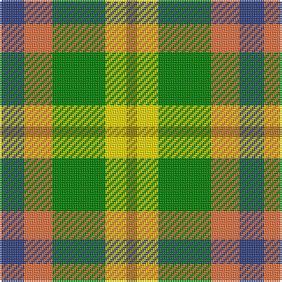

The parent of this is [Unidentified, Silk Plaid](/tartans/b/14/o16/g30/y12/lg/6/)

This was sourced from weddslist.  It is a [5 stripes tartan](/stripes/stripes5/).

Original link http://www.weddslist.com/cgi-bin/tartans/pg.pl?source=sts

## Thread count
B/14 O16 G30 Y12 LG/6

## Palette
Each colour and its ΔE from the base-6 reference it is a variant of.

| Colour | Shade | Base | ΔE (OKLab) |
|---|---|---|---|
| B |  `#304080` | B  | 0.01 |
| G |  `#008000` | G  | 0.09 |
| LG |  `#908000` | G  | 0.19 |
| O |  `#F07040` | R  | 0.18 |
| Y |  `#FFE000` | Y  | 0.09 |

# Sample pattern

ID: /variants/b/14/o16/g30/y12/lg/6-b304080-g008000-lg908000-of07040-yffe000/
