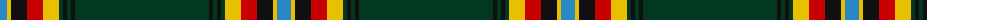

The parent of this is [Moran (French) (Name)](/tartans/b/14/y4/k16/r16/y16/dg4/k4/dg4/k4/dg/134/)

This was sourced from tartans-authority.  It is a [10 stripes tartan](/stripes/stripes10/).

Original link http://www.tartansauthority.com/tartan-ferret/display/7385/

## Thread count
B/14 Y4 K16 R16 Y16 DG4 K4 DG4 K4 DG/134

## Palette
Each colour and its ΔE from the base-6 reference it is a variant of.

| Colour | Shade | Base | ΔE (OKLab) |
|---|---|---|---|
| B |  `#2888C4` | B  | 0.21 |
| DG |  `#003820` | G  | 0.16 |
| K |  `#101010` | K  | 0.17 |
| R |  `#C80000` | R  | 0.00 |
| Y |  `#E8C000` | Y  | 0.00 |

ID: /variants/b/14/y4/k16/r16/y16/dg4/k4/dg4/k4/dg/134-b2888c4-dg003820-k101010-rc80000-ye8c000/
