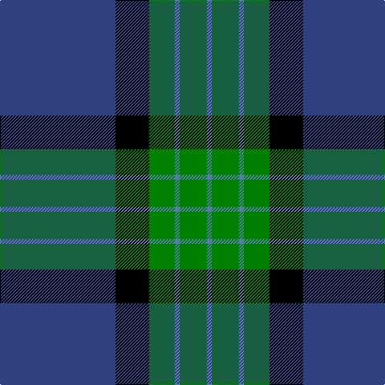

The parent of this is [MacRobart](/tartans/b/144/k42/g32/ba6/g34/ba/6/)

This was sourced from weddslist.  It is a [6 stripes tartan](/stripes/stripes6/).

Original link http://www.weddslist.com/cgi-bin/tartans/pg.pl?source=sts

## Thread count
B/144 K42 G32 Ba6 G34 Ba/6

## Palette
Each colour and its ΔE from the base-6 reference it is a variant of.

| Colour | Shade | Base | ΔE (OKLab) |
|---|---|---|---|
| B |  `#304080` | B  | 0.01 |
| Ba |  `#5480B0` | B  | 0.20 |
| G |  `#008000` | G  | 0.09 |
| K |  `#000000` | K  | 0.00 |

# Sample pattern

ID: /variants/b/144/k42/g32/ba6/g34/ba/6-b304080-ba5480b0-g008000-k000000/
