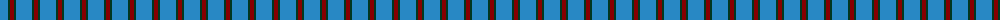
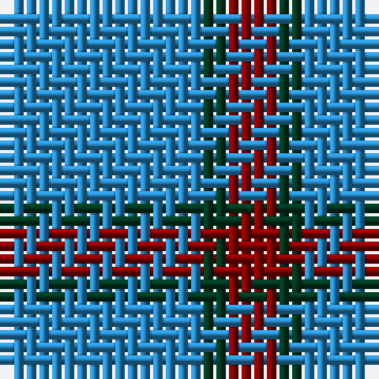

The parent of this is [Gyle (Corporate)](/tartans/b/16/dg2/dr/4/)

This was sourced from tartans-authority.  It is a [3 stripes tartan](/stripes/stripes3/).

Original link http://www.tartansauthority.com/tartan-ferret/display/2692/

## Thread count
B/16 DG2 DR/4

## Palette
Each colour and its ΔE from the base-6 reference it is a variant of.

| Colour | Shade | Base | ΔE (OKLab) |
|---|---|---|---|
| B |  `#2888C4` | B  | 0.21 |
| DG |  `#003820` | G  | 0.16 |
| DR |  `#880000` | R  | 0.14 |

# Sample pattern

ID: /variants/b/16/dg2/dr/4-b2888c4-dg003820-dr880000/
