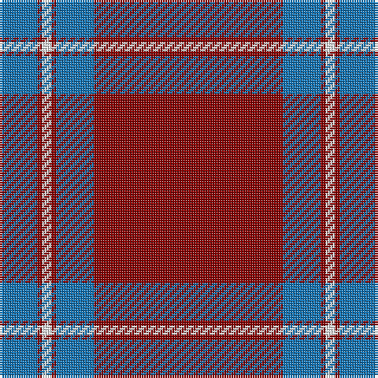

The parent of this is [Lyon College (Corporate)](/tartans/b/16/dr2/w4/dr2/b16/dr/80/)

This was sourced from tartans-authority.  It is a [6 stripes tartan](/stripes/stripes6/).

Original link http://www.tartansauthority.com/tartan-ferret/display/2412/

## Thread count
B/16 DR2 W4 DR2 B16 DR/80

## Palette
Each colour and its ΔE from the base-6 reference it is a variant of.

| Colour | Shade | Base | ΔE (OKLab) |
|---|---|---|---|
| B |  `#1474B4` | B  | 0.15 |
| DR |  `#880000` | R  | 0.14 |
| W |  `#F8F8F8` | W  | 0.01 |

# Sample pattern

ID: /variants/b/16/dr2/w4/dr2/b16/dr/80-b1474b4-dr880000-wf8f8f8/
