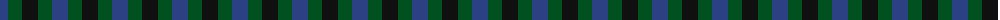
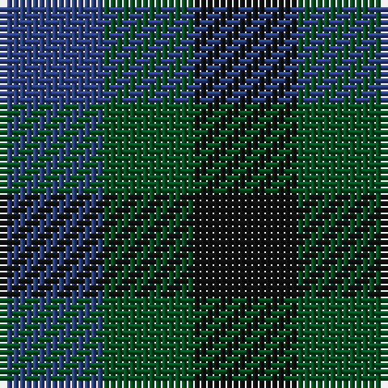

The parent of this is [Glenlyon](/tartans/b/16/g14/k/16/)

This was sourced from register-of-tartans.  It is a [3 stripes tartan](/stripes/stripes3/).

Original link https://www.tartanregister.gov.uk/tartanDetails.aspx?ref=1423

## Thread count
B/16 G14 K/16

## Palette
Each colour and its ΔE from the base-6 reference it is a variant of.

| Colour | Shade | Base | ΔE (OKLab) |
|---|---|---|---|
| B |  `#2C4084` | B  | 0.00 |
| G |  `#005020` | G  | 0.08 |
| K |  `#101010` | K  | 0.17 |

# Sample pattern

ID: /variants/b/16/g14/k/16-b2c4084-g005020-k101010/
