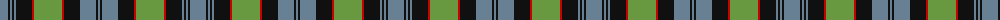

The parent of this is [Riddoch (Name)](/tartans/b/16/k2/b2/k2/b2/k16/r2/lg28/r2/k16/b16/k2/b/2/)

This was sourced from tartans-authority.  It is a [13 stripes tartan](/stripes/stripes13/).

Original link http://www.tartansauthority.com/tartan-ferret/display/3316/

## Thread count
B/16 K2 B2 K2 B2 K16 R2 LG28 R2 K16 B16 K2 B/2

## Palette
Each colour and its ΔE from the base-6 reference it is a variant of.

| Colour | Shade | Base | ΔE (OKLab) |
|---|---|---|---|
| B |  `#688094` | B  | 0.21 |
| K |  `#101010` | K  | 0.17 |
| LG |  `#689840` | G  | 0.19 |
| R |  `#C80000` | R  | 0.00 |

ID: /variants/b/16/k2/b2/k2/b2/k16/r2/lg28/r2/k16/b16/k2/b/2-b688094-k101010-lg689840-rc80000/
