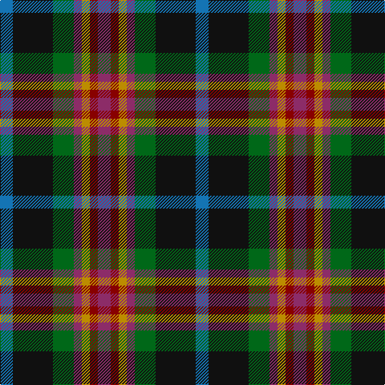

The parent of this is [Bro-Menez Are (Corporate)](/tartans/b/16/k50/g26/dr10/dy10/dra10/dr/16/)

This was sourced from tartans-authority.  It is a [7 stripes tartan](/stripes/stripes7/).

Original link http://www.tartansauthority.com/tartan-ferret/display/7905/

## Thread count
B/16 K50 G26 DR10 DY10 DRa10 DR/16

## Palette
Each colour and its ΔE from the base-6 reference it is a variant of.

| Colour | Shade | Base | ΔE (OKLab) |
|---|---|---|---|
| B |  `#1474B4` | B  | 0.15 |
| DR |  `#8C2C68` | R  | 0.16 |
| DRa |  `#880000` | R  | 0.14 |
| DY |  `#BC8C00` | Y  | 0.16 |
| G |  `#006818` | G  | 0.02 |
| K |  `#101010` | K  | 0.17 |

# Sample pattern

ID: /variants/b/16/k50/g26/dr10/dy10/dra10/dr/16-b1474b4-dr8c2c68-dra880000-dybc8c00-g006818-k101010/
