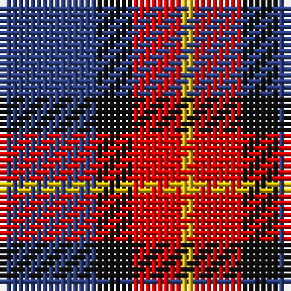

The parent of this is [Unidentified #17](/tartans/b/16/k6/r8/y/2/)

This was sourced from register-of-tartans.  It is a [4 stripes tartan](/stripes/stripes4/).

Original link https://www.tartanregister.gov.uk/tartanDetails.aspx?ref=4218

## Thread count
B/16 K6 R8 Y/2

## Palette
Each colour and its ΔE from the base-6 reference it is a variant of.

| Colour | Shade | Base | ΔE (OKLab) |
|---|---|---|---|
| B |  `#2C4084` | B  | 0.00 |
| K |  `#101010` | K  | 0.17 |
| R |  `#DC0000` | R  | 0.04 |
| Y |  `#E8C000` | Y  | 0.00 |

# Sample pattern

ID: /variants/b/16/k6/r8/y/2-b2c4084-k101010-rdc0000-ye8c000/
