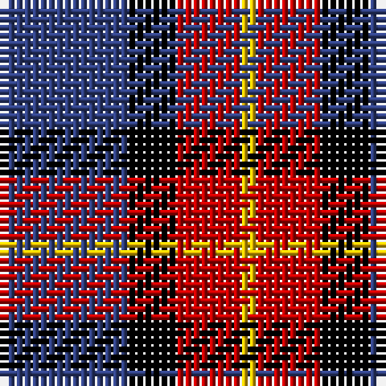

The parent of this is [Unidentified 27](/tartans/b/16/k6/r8/y/2/)

This was sourced from weddslist.  It is a [4 stripes tartan](/stripes/stripes4/).

Original link http://www.weddslist.com/cgi-bin/tartans/pg.pl?source=sts

## Thread count
B/16 K6 R8 Y/2

## Palette
Each colour and its ΔE from the base-6 reference it is a variant of.

| Colour | Shade | Base | ΔE (OKLab) |
|---|---|---|---|
| B |  `#304080` | B  | 0.01 |
| K |  `#000000` | K  | 0.00 |
| R |  `#C00000` | R  | 0.02 |
| Y |  `#F0C000` | Y  | 0.01 |

# Sample pattern

ID: /variants/b/16/k6/r8/y/2-b304080-k000000-rc00000-yf0c000/
