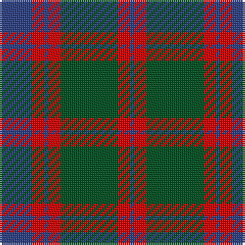

The parent of this is [Logan](/tartans/b/16/r6/b2/r6/g28/r6/b/2/)

This was sourced from register-of-tartans.  It is a [7 stripes tartan](/stripes/stripes7/).

Original link https://www.tartanregister.gov.uk/tartanDetails.aspx?ref=2181

## Thread count
B/16 R6 B2 R6 G28 R6 B/2

## Palette
Each colour and its ΔE from the base-6 reference it is a variant of.

| Colour | Shade | Base | ΔE (OKLab) |
|---|---|---|---|
| B |  `#2C4084` | B  | 0.00 |
| G |  `#005020` | G  | 0.08 |
| R |  `#DC0000` | R  | 0.04 |

# Sample pattern

ID: /variants/b/16/r6/b2/r6/g28/r6/b/2-b2c4084-g005020-rdc0000/
