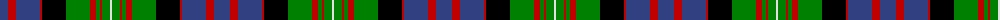

The parent of this is [MacDonell of Glengarry](/tartans/b/16/r8/b24/r2/k24/g24/r6/g4/r2/g8/ln/2/)

This was sourced from weddslist.  It is a [11 stripes tartan](/stripes/stripes11/).

Original link http://www.weddslist.com/cgi-bin/tartans/pg.pl?source=sts

## Thread count
B/16 R8 B24 R2 K24 G24 R6 G4 R2 G8 LN/2

## Palette
Each colour and its ΔE from the base-6 reference it is a variant of.

| Colour | Shade | Base | ΔE (OKLab) |
|---|---|---|---|
| B |  `#304080` | B  | 0.01 |
| G |  `#008000` | G  | 0.09 |
| K |  `#000000` | K  | 0.00 |
| LN |  `#E0E0E0` | W  | 0.06 |
| R |  `#C00000` | R  | 0.02 |

ID: /variants/b/16/r8/b24/r2/k24/g24/r6/g4/r2/g8/ln/2-b304080-g008000-k000000-lne0e0e0-rc00000/
