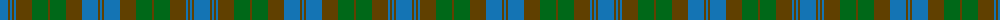

The parent of this is [Tyneside Scottish (Blue) (District)](/tartans/b/16/t2/b2/t2/b2/t16/g16/t2/g16/t16/b16/t2/b/2/)

This was sourced from tartans-authority.  It is a [13 stripes tartan](/stripes/stripes13/).

Original link http://www.tartansauthority.com/tartan-ferret/display/593/

## Thread count
B/16 T2 B2 T2 B2 T16 G16 T2 G16 T16 B16 T2 B/2

## Palette
Each colour and its ΔE from the base-6 reference it is a variant of.

| Colour | Shade | Base | ΔE (OKLab) |
|---|---|---|---|
| B |  `#1474B4` | B  | 0.15 |
| G |  `#006818` | G  | 0.02 |
| T |  `#604000` | G  | 0.14 |

ID: /variants/b/16/t2/b2/t2/b2/t16/g16/t2/g16/t16/b16/t2/b/2-b1474b4-g006818-t604000/
