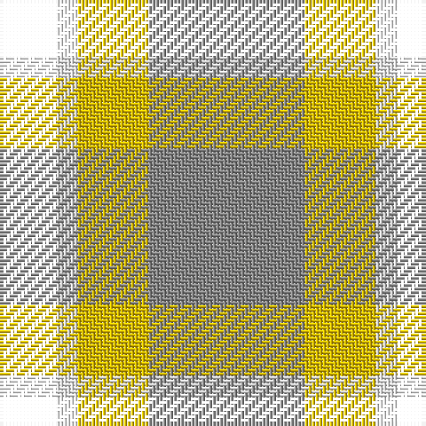

The parent of this is [Louisburg Canadian District Tartan Tartan Number: 5500. Earliest known date: 1994 Louisburg is a tiny seaside town in Nova Scotia about 20 miles southeast of Sydney and site of the 1758 Battle of Louisburgh. It was designed by Edith MacIntyre of Louisbourg with the assistance of Jean Kyte and Jean composed the following poem about the colours. CIDD count slightly different - RB/20 W8 Y20 LN/34 (John Fitzpatrick's July 2008 review of Canadian tartans). Gray fog and sea and rocks. The yellow sun. white spindrift on the harbour restless beneath an azure sky. Curent owners (2008): The Louisbourg Heritage Society P.O. Box 396 Louisbourg, B0A 1M0 Nova Scotia, Canada See products available Copyright © Blair Urquhart, Comrie, 2015](/tartans/b/16/w6/y20/n/44/)

This was sourced from house-of-tartan.  It is a [4 stripes tartan](/stripes/stripes4/).

Original link http://www.house-of-tartan.scotland.net/house/TartanViewjs.asp?colr=Def&tnam=5500

## Thread count
B/16 W6 Y20 N/44

## Palette
Each colour and its ΔE from the base-6 reference it is a variant of.

| Colour | Shade | Base | ΔE (OKLab) |
|---|---|---|---|
| DB |  `#1C0070` | B  | 0.14 |
| DY |  `#D09800` | Y  | 0.11 |
| N |  `#888888` | R  | 0.24 |
| Na |  `#C0C0C0` | W  | 0.16 |
| W |  `#F8F8F8` | W  | 0.01 |
| Y |  `#E8C000` | Y  | 0.00 |

# Sample pattern

ID: /variants/b/16/w6/y20/n/44-db1c0070-dyd09800-n888888-nac0c0c0-wf8f8f8-ye8c000/
