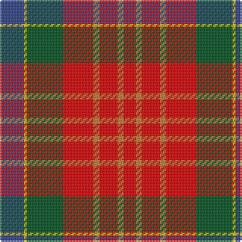

The parent of this is [Indiana "Cardinal"](/tartans/b/16/y2/g24/r20/do4/r12/do4/r/8/)

This was sourced from register-of-tartans.  It is a [8 stripes tartan](/stripes/stripes8/).

Original link https://www.tartanregister.gov.uk/tartanDetails.aspx?ref=5874

## Thread count
B/16 Y2 G24 R20 DO4 R12 DO4 R/8

## Palette
Each colour and its ΔE from the base-6 reference it is a variant of.

| Colour | Shade | Base | ΔE (OKLab) |
|---|---|---|---|
| B |  `#2C4084` | B  | 0.00 |
| DO |  `#BE7832` | R  | 0.17 |
| G |  `#005020` | G  | 0.08 |
| R |  `#DC0000` | R  | 0.04 |
| Y |  `#E8C000` | Y  | 0.00 |

# Sample pattern

ID: /variants/b/16/y2/g24/r20/do4/r12/do4/r/8-b2c4084-dobe7832-g005020-rdc0000-ye8c000/
