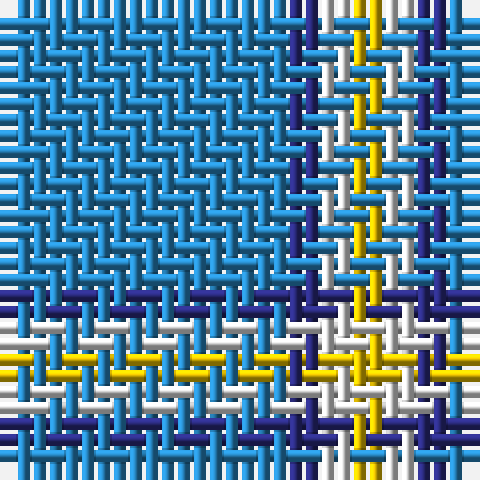

The parent of this is [Varrie Commemorative Tartan Tartan Number: 9113. Earliest known date: 2009 November I have designed this tartan in remembrance of my mother Jean Alexander Varrie and for her Scottish Heritage, and all the Varrie Family's can used this design. See products available Copyright © Blair Urquhart, Comrie, 2015](/tartans/b/18/db2/ln2/y/2/)

This was sourced from house-of-tartan.  It is a [4 stripes tartan](/stripes/stripes4/).

Original link http://www.house-of-tartan.scotland.net/house/TartanViewjs.asp?colr=Def&tnam=9113

## Thread count
B/18 DB2 LN2 Y/2

## Palette
Each colour and its ΔE from the base-6 reference it is a variant of.

| Colour | Shade | Base | ΔE (OKLab) |
|---|---|---|---|
| B |  `#2888C4` | B  | 0.21 |
| DB |  `#2C2C80` | B  | 0.05 |
| LN |  `#E0E0E0` | W  | 0.06 |
| Y |  `#E8C000` | Y  | 0.00 |

# Sample pattern

ID: /variants/b/18/db2/ln2/y/2-b2888c4-db2c2c80-lne0e0e0-ye8c000/
