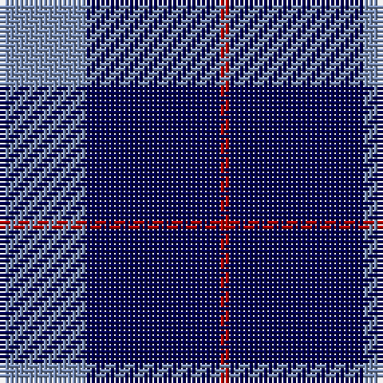

The parent of this is [Stakis Hotels (Corporate)](/tartans/b/18/db28/dr/2/)

This was sourced from tartans-authority.  It is a [3 stripes tartan](/stripes/stripes3/).

Original link http://www.tartansauthority.com/tartan-ferret/display/4169/

## Thread count
B/18 DB28 DR/2

## Palette
Each colour and its ΔE from the base-6 reference it is a variant of.

| Colour | Shade | Base | ΔE (OKLab) |
|---|---|---|---|
| B |  `#788CB4` | B  | 0.25 |
| DB |  `#000050` | B  | 0.20 |
| DR |  `#B00000` | R  | 0.05 |

# Sample pattern

ID: /variants/b/18/db28/dr/2-b788cb4-db000050-drb00000/
