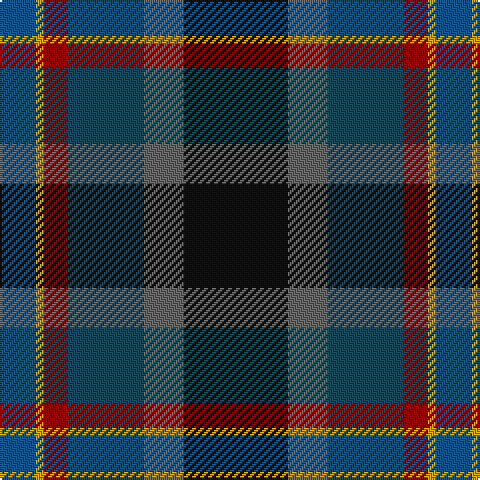

The parent of this is [Meeson Hunting](/tartans/b/18/dy4/dr12/db38/n20/k/52/)

This was sourced from register-of-tartans.  It is a [6 stripes tartan](/stripes/stripes6/).

Original link https://www.tartanregister.gov.uk/tartanDetails.aspx?ref=6027

## Thread count
B/18 DY4 DR12 DB38 N20 K/52

## Palette
Each colour and its ΔE from the base-6 reference it is a variant of.

| Colour | Shade | Base | ΔE (OKLab) |
|---|---|---|---|
| B |  `#105088` | B  | 0.05 |
| DB |  `#184458` | B  | 0.08 |
| DR |  `#880000` | R  | 0.14 |
| DY |  `#C89800` | Y  | 0.12 |
| K |  `#101010` | K  | 0.17 |
| N |  `#646464` | B  | 0.16 |

# Sample pattern

ID: /variants/b/18/dy4/dr12/db38/n20/k/52-b105088-db184458-dr880000-dyc89800-k101010-n646464/
