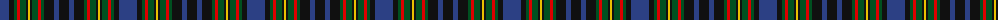

The parent of this is [MacClellan](/tartans/b/18/k5/g3/r3/g6/k2/y2/k2/g6/r3/g3/k10/b5/k/10/)

This was sourced from register-of-tartans.  It is a [14 stripes tartan](/stripes/stripes14/).

Original link https://www.tartanregister.gov.uk/tartanDetails.aspx?ref=2313

## Thread count
B/18 K5 G3 R3 G6 K2 Y2 K2 G6 R3 G3 K10 B5 K/10

## Palette
Each colour and its ΔE from the base-6 reference it is a variant of.

| Colour | Shade | Base | ΔE (OKLab) |
|---|---|---|---|
| B |  `#2C4084` | B  | 0.00 |
| G |  `#005020` | G  | 0.08 |
| K |  `#101010` | K  | 0.17 |
| R |  `#DC0000` | R  | 0.04 |
| Y |  `#E8C000` | Y  | 0.00 |

ID: /variants/b/18/k5/g3/r3/g6/k2/y2/k2/g6/r3/g3/k10/b5/k/10-b2c4084-g005020-k101010-rdc0000-ye8c000/
