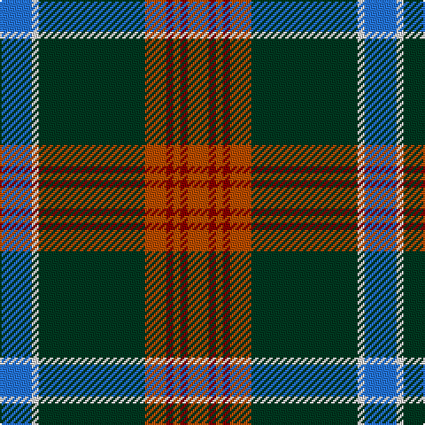

The parent of this is [Ware/Warr (Name)](/tartans/b/18/ln4/dg60/do12/dr4/do4/dr4/do/12/)

This was sourced from tartans-authority.  It is a [8 stripes tartan](/stripes/stripes8/).

Original link http://www.tartansauthority.com/tartan-ferret/display/8587/

## Thread count
B/18 LN4 DG60 DO12 DR4 DO4 DR4 DO/12

## Palette
Each colour and its ΔE from the base-6 reference it is a variant of.

| Colour | Shade | Base | ΔE (OKLab) |
|---|---|---|---|
| B |  `#2474E8` | B  | 0.20 |
| DG |  `#003820` | G  | 0.16 |
| DO |  `#B84C00` | R  | 0.08 |
| DR |  `#880000` | R  | 0.14 |
| LN |  `#E0E0E0` | W  | 0.06 |

# Sample pattern

ID: /variants/b/18/ln4/dg60/do12/dr4/do4/dr4/do/12-b2474e8-dg003820-dob84c00-dr880000-lne0e0e0/
