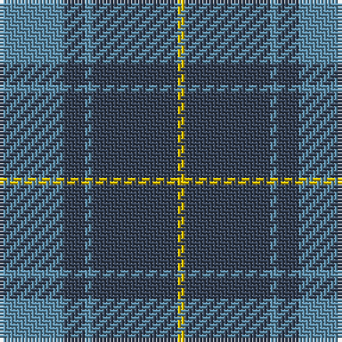

The parent of this is [North Sea Commission (Corporate)](/tartans/b/18/n6/b2/n24/y/2/)

This was sourced from tartans-authority.  It is a [5 stripes tartan](/stripes/stripes5/).

Original link http://www.tartansauthority.com/tartan-ferret/display/6938/

## Thread count
B/18 N6 B2 N24 Y/2

## Palette
Each colour and its ΔE from the base-6 reference it is a variant of.

| Colour | Shade | Base | ΔE (OKLab) |
|---|---|---|---|
| B |  `#5C8CA8` | B  | 0.23 |
| N |  `#344054` | B  | 0.08 |
| Y |  `#E8C000` | Y  | 0.00 |

# Sample pattern

ID: /variants/b/18/n6/b2/n24/y/2-b5c8ca8-n344054-ye8c000/
