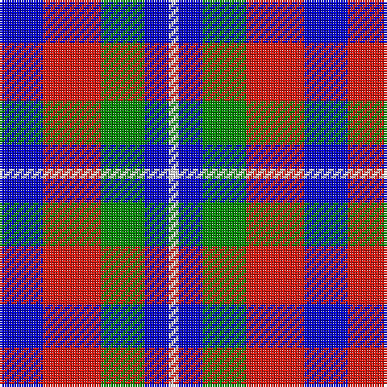

The parent of this is [Battle of Prestonpans (1745) Heritage Trust, The](/tartans/b/18/r24/g18/b10/w/4/)

This was sourced from register-of-tartans.  It is a [5 stripes tartan](/stripes/stripes5/).

Original link https://www.tartanregister.gov.uk/tartanDetails.aspx?ref=10841

## Thread count
B/18 R24 G18 B10 W/4

## Palette
Each colour and its ΔE from the base-6 reference it is a variant of.

| Colour | Shade | Base | ΔE (OKLab) |
|---|---|---|---|
| B |  `#0000CD` | B  | 0.15 |
| G |  `#008B00` | G  | 0.12 |
| R |  `#E3170D` | R  | 0.06 |
| W |  `#FFFFFF` | W  | 0.03 |

# Sample pattern

ID: /variants/b/18/r24/g18/b10/w/4-b0000cd-g008b00-re3170d-wffffff/
