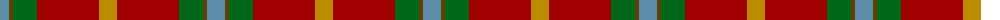

The parent of this is [Buncle (Name)](/tartans/b/18/t4/g24/dr62/dy/18/)

This was sourced from tartans-authority.  It is a [5 stripes tartan](/stripes/stripes5/).

Original link http://www.tartansauthority.com/tartan-ferret/display/10300/

## Thread count
B/18 T4 G24 DR62 DY/18

## Palette
Each colour and its ΔE from the base-6 reference it is a variant of.

| Colour | Shade | Base | ΔE (OKLab) |
|---|---|---|---|
| B |  `#5C8CA8` | B  | 0.23 |
| DR |  `#A00000` | R  | 0.09 |
| DY |  `#BC8C00` | Y  | 0.16 |
| G |  `#006818` | G  | 0.02 |
| T |  `#604000` | G  | 0.14 |

# Sample pattern

ID: /variants/b/18/t4/g24/dr62/dy/18-b5c8ca8-dra00000-dybc8c00-g006818-t604000/
