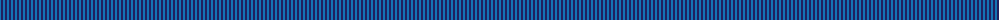
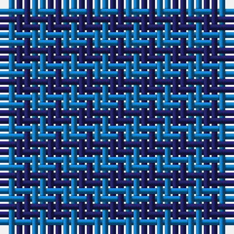

The parent of this is [St. Combs Fisher Plaid](/tartans/b/2/db/2/)

This was sourced from tartans-authority.  It is a [2 stripes tartan](/stripes/stripes2/).

Original link http://www.tartansauthority.com/tartan-ferret/display/8968/

## Thread count
B/2 DB/2

## Palette
Each colour and its ΔE from the base-6 reference it is a variant of.

| Colour | Shade | Base | ΔE (OKLab) |
|---|---|---|---|
| B |  `#1474B4` | B  | 0.15 |
| DB |  `#202060` | B  | 0.11 |

# Sample pattern

ID: /variants/b/2/db/2-b1474b4-db202060/
