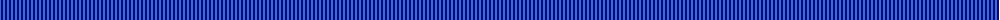
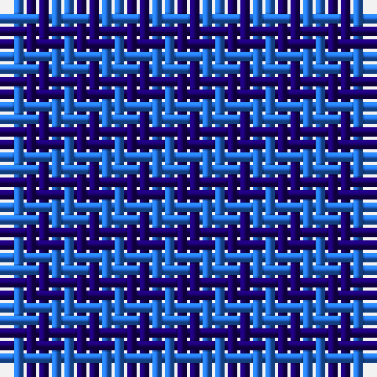

The parent of this is [Rob Roy, Blue (Fashion)](/tartans/b/2/db/2/)

This was sourced from tartans-authority.  It is a [2 stripes tartan](/stripes/stripes2/).

Original link http://www.tartansauthority.com/tartan-ferret/display/3155/

## Thread count
B/2 DB/2

## Palette
Each colour and its ΔE from the base-6 reference it is a variant of.

| Colour | Shade | Base | ΔE (OKLab) |
|---|---|---|---|
| B |  `#2474E8` | B  | 0.20 |
| DB |  `#1C0070` | B  | 0.14 |

# Sample pattern

ID: /variants/b/2/db/2-b2474e8-db1c0070/
