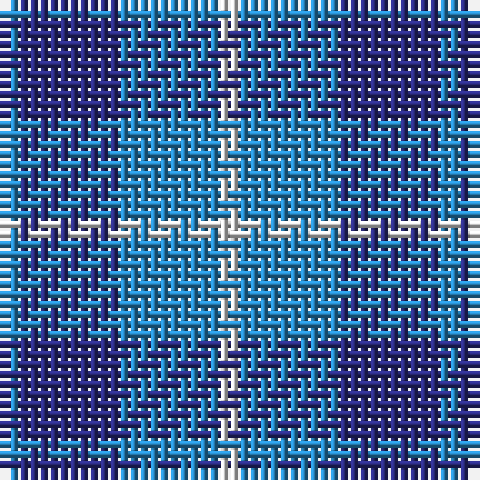

The parent of this is [Manx Cornaa (Personal)](/tartans/b/2/db10/b10/ln/2/)

This was sourced from tartans-authority.  It is a [4 stripes tartan](/stripes/stripes4/).

Original link http://www.tartansauthority.com/tartan-ferret/display/44/

## Thread count
B/2 DB10 B10 LN/2

## Palette
Each colour and its ΔE from the base-6 reference it is a variant of.

| Colour | Shade | Base | ΔE (OKLab) |
|---|---|---|---|
| B |  `#2888C4` | B  | 0.21 |
| DB |  `#2C2C80` | B  | 0.05 |
| LN |  `#E0E0E0` | W  | 0.06 |

# Sample pattern

ID: /variants/b/2/db10/b10/ln/2-b2888c4-db2c2c80-lne0e0e0/
