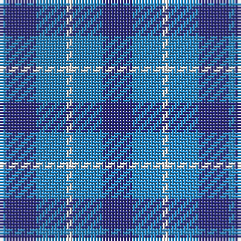

The parent of this is [Manx Cornaa (Personal)](/tartans/b/2/db10/b10/ln2/b10/db/10/)

This was sourced from register-of-tartans.  It is a [6 stripes tartan](/stripes/stripes6/).

Original link https://www.tartanregister.gov.uk/tartanDetails.aspx?ref=2813

## Thread count
B/2 DB10 B10 LN2 B10 DB/10

## Palette
Each colour and its ΔE from the base-6 reference it is a variant of.

| Colour | Shade | Base | ΔE (OKLab) |
|---|---|---|---|
| B |  `#2888C4` | B  | 0.21 |
| DB |  `#2C2C80` | B  | 0.05 |
| LN |  `#E0E0E0` | W  | 0.06 |

# Sample pattern

ID: /variants/b/2/db10/b10/ln2/b10/db/10-b2888c4-db2c2c80-lne0e0e0/
