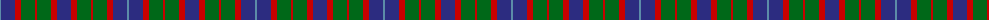

The parent of this is [Hebrides #8](/tartans/b/2/db14/r6/g14/r2/g14/r6/db/14/)

This was sourced from register-of-tartans.  It is a [8 stripes tartan](/stripes/stripes8/).

Original link https://www.tartanregister.gov.uk/tartanDetails.aspx?ref=1664

## Thread count
B/2 DB14 R6 G14 R2 G14 R6 DB/14

## Palette
Each colour and its ΔE from the base-6 reference it is a variant of.

| Colour | Shade | Base | ΔE (OKLab) |
|---|---|---|---|
| B |  `#5C8CA8` | B  | 0.23 |
| DB |  `#2C2C80` | B  | 0.05 |
| G |  `#006818` | G  | 0.02 |
| R |  `#C80000` | R  | 0.00 |

# Sample pattern

ID: /variants/b/2/db14/r6/g14/r2/g14/r6/db/14-b5c8ca8-db2c2c80-g006818-rc80000/
