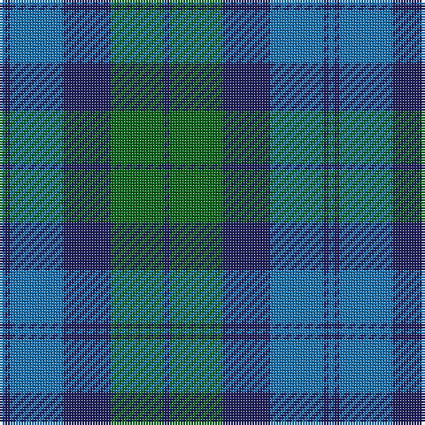

The parent of this is [Black Watch (Aljean)](/tartans/b/2/db2/b20/db18/g20/db/2/)

This was sourced from register-of-tartans.  It is a [6 stripes tartan](/stripes/stripes6/).

Original link https://www.tartanregister.gov.uk/tartanDetails.aspx?ref=5372

## Thread count
B/2 DB2 B20 DB18 G20 DB/2

## Palette
Each colour and its ΔE from the base-6 reference it is a variant of.

| Colour | Shade | Base | ΔE (OKLab) |
|---|---|---|---|
| B |  `#1474B4` | B  | 0.15 |
| DB |  `#202060` | B  | 0.11 |
| G |  `#006818` | G  | 0.02 |

# Sample pattern

ID: /variants/b/2/db2/b20/db18/g20/db/2-b1474b4-db202060-g006818/
