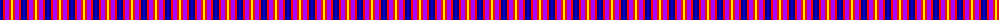
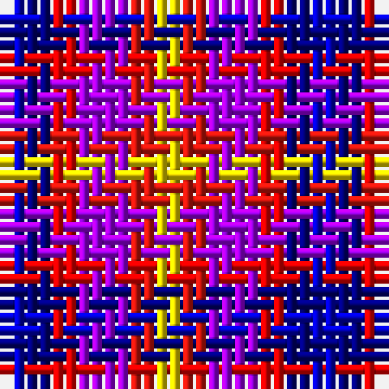

The parent of this is [Lytley alias Parsons Formal (Personal)](/tartans/b/2/db2/r2/p4/ra2/y/2/)

This was sourced from register-of-tartans.  It is a [6 stripes tartan](/stripes/stripes6/).

Original link https://www.tartanregister.gov.uk/tartanDetails.aspx?ref=10476

## Thread count
B/2 DB2 R2 P4 Ra2 Y/2

## Palette
Each colour and its ΔE from the base-6 reference it is a variant of.

| Colour | Shade | Base | ΔE (OKLab) |
|---|---|---|---|
| B |  `#0000CD` | B  | 0.15 |
| DB |  `#000080` | B  | 0.14 |
| P |  `#AA00FF` | B  | 0.29 |
| R |  `#FF0000` | R  | 0.11 |
| Ra |  `#E3170D` | R  | 0.06 |
| Y |  `#FFE600` | Y  | 0.10 |

# Sample pattern

ID: /variants/b/2/db2/r2/p4/ra2/y/2-b0000cd-db000080-paa00ff-rff0000-rae3170d-yffe600/
