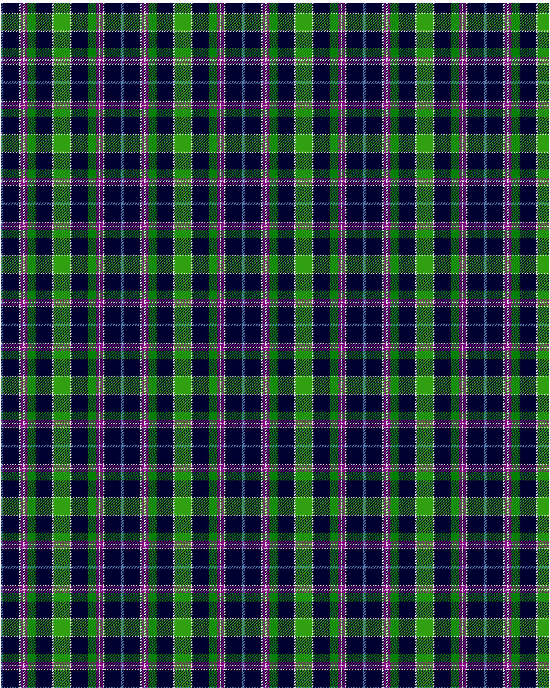

Head of the Lakes

This was sourced from <no value>.  It is a 10 stripes tartan.

Original link http://www.weddslist.com/cgi-bin/tartans/pg.pl?source=sts

## Thread count
B/2 DB24 LN2 P4 LN2 P4 GA12 DB24 LN2 G/12

## Palette
B#5480B0 DB#000030 G#30A010 GA#008000 LN#E0E0E0 P#800080

# Sample pattern

ID: /variants/b/2/db24/ln2/p4/ln2/p4/ga12/db24/ln2/g/12-b5480b0-db000030-g30a010-ga008000-lne0e0e0-p800080