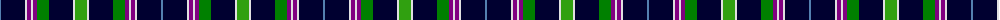

The parent of this is [Head of the Lakes](/tartans/b/2/db24/ln2/p4/ln2/p4/ga12/db24/ln2/g/12/)

This was sourced from weddslist.  It is a [10 stripes tartan](/stripes/stripes10/).

Original link http://www.weddslist.com/cgi-bin/tartans/pg.pl?source=sts

## Thread count
B/2 DB24 LN2 P4 LN2 P4 Ga12 DB24 LN2 G/12

## Palette
Each colour and its ΔE from the base-6 reference it is a variant of.

| Colour | Shade | Base | ΔE (OKLab) |
|---|---|---|---|
| B |  `#5480B0` | B  | 0.20 |
| DB |  `#000030` | K  | 0.17 |
| G |  `#30A010` | G  | 0.19 |
| Ga |  `#008000` | G  | 0.09 |
| LN |  `#E0E0E0` | W  | 0.06 |
| P |  `#800080` | B  | 0.17 |

ID: /variants/b/2/db24/ln2/p4/ln2/p4/ga12/db24/ln2/g/12-b5480b0-db000030-g30a010-ga008000-lne0e0e0-p800080/
