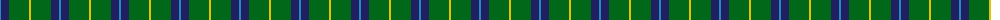
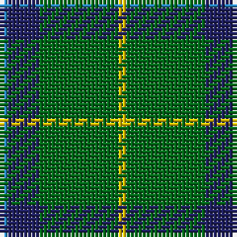

The parent of this is [Wilson's No.174](/tartans/b/2/db8/g20/y/2/)

This was sourced from register-of-tartans.  It is a [4 stripes tartan](/stripes/stripes4/).

Original link https://www.tartanregister.gov.uk/tartanDetails.aspx?ref=4713

## Thread count
B/2 DB8 G20 Y/2

## Palette
Each colour and its ΔE from the base-6 reference it is a variant of.

| Colour | Shade | Base | ΔE (OKLab) |
|---|---|---|---|
| B |  `#2888C4` | B  | 0.21 |
| DB |  `#202060` | B  | 0.11 |
| DG |  `#003820` | G  | 0.16 |
| G |  `#006818` | G  | 0.02 |
| Y |  `#E8C000` | Y  | 0.00 |

# Sample pattern

ID: /variants/b/2/db8/g20/y/2-b2888c4-db202060-dg003820-g006818-ye8c000/
