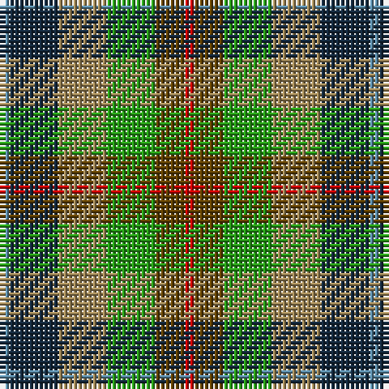

The parent of this is [Loch Fyne (District)](/tartans/b/2/dn10/lt10/g10/t6/r/2/)

This was sourced from tartans-authority.  It is a [6 stripes tartan](/stripes/stripes6/).

Original link http://www.tartansauthority.com/tartan-ferret/display/6817/

## Thread count
B/2 DN10 LT10 G10 T6 R/2

## Palette
Each colour and its ΔE from the base-6 reference it is a variant of.

| Colour | Shade | Base | ΔE (OKLab) |
|---|---|---|---|
| B |  `#5C8CA8` | B  | 0.23 |
| DN |  `#14283C` | B  | 0.14 |
| G |  `#289C18` | G  | 0.18 |
| LT |  `#A08858` | Y  | 0.21 |
| R |  `#C80000` | R  | 0.00 |
| T |  `#604000` | G  | 0.14 |

# Sample pattern

ID: /variants/b/2/dn10/lt10/g10/t6/r/2-b5c8ca8-dn14283c-g289c18-lta08858-rc80000-t604000/
