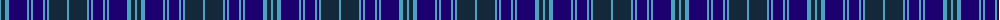

The parent of this is [Caledonian Airways (Corporate)](/tartans/b/2/dn4/b4/db18/b2/db2/b2/db10/b2/db2/b2/dn18/b/2/)

This was sourced from tartans-authority.  It is a [13 stripes tartan](/stripes/stripes13/).

Original link http://www.tartansauthority.com/tartan-ferret/display/3781/

## Thread count
B/2 DN4 B4 DB18 B2 DB2 B2 DB10 B2 DB2 B2 DN18 B/2

## Palette
Each colour and its ΔE from the base-6 reference it is a variant of.

| Colour | Shade | Base | ΔE (OKLab) |
|---|---|---|---|
| B |  `#48A4C0` | Y  | 0.28 |
| DB |  `#1C0070` | B  | 0.14 |
| DN |  `#14283C` | B  | 0.14 |

ID: /variants/b/2/dn4/b4/db18/b2/db2/b2/db10/b2/db2/b2/dn18/b/2-b48a4c0-db1c0070-dn14283c/
