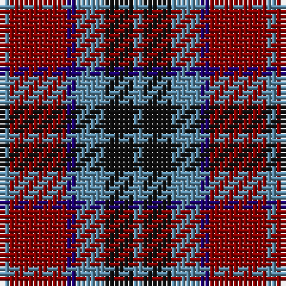

The parent of this is [MacTavish (Clan)](/tartans/b/2/dr12/db2/b6/k6/b/2/)

This was sourced from tartans-authority.  It is a [6 stripes tartan](/stripes/stripes6/).

Original link http://www.tartansauthority.com/tartan-ferret/display/3598/

## Thread count
B/2 DR12 DB2 B6 K6 B/2

## Palette
Each colour and its ΔE from the base-6 reference it is a variant of.

| Colour | Shade | Base | ΔE (OKLab) |
|---|---|---|---|
| B |  `#5C8CA8` | B  | 0.23 |
| DB |  `#1C0070` | B  | 0.14 |
| DR |  `#880000` | R  | 0.14 |
| K |  `#101010` | K  | 0.17 |

# Sample pattern

ID: /variants/b/2/dr12/db2/b6/k6/b/2-b5c8ca8-db1c0070-dr880000-k101010/
