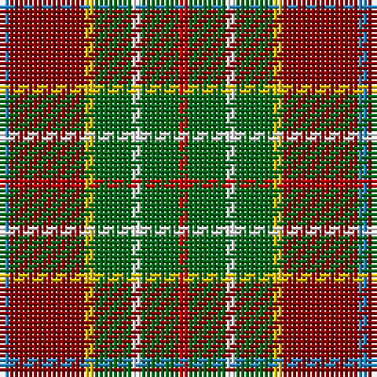

The parent of this is [George Watson's College (Corporate)](/tartans/b/2/dr16/y2/g8/w2/g8/r/2/)

This was sourced from tartans-authority.  It is a [7 stripes tartan](/stripes/stripes7/).

Original link http://www.tartansauthority.com/tartan-ferret/display/4973/

## Thread count
B/2 DR16 Y2 G8 W2 G8 R/2

## Palette
Each colour and its ΔE from the base-6 reference it is a variant of.

| Colour | Shade | Base | ΔE (OKLab) |
|---|---|---|---|
| B |  `#2888C4` | B  | 0.21 |
| DR |  `#880000` | R  | 0.14 |
| G |  `#006818` | G  | 0.02 |
| R |  `#C80000` | R  | 0.00 |
| W |  `#FCFCFC` | W  | 0.03 |
| Y |  `#E8C000` | Y  | 0.00 |

# Sample pattern

ID: /variants/b/2/dr16/y2/g8/w2/g8/r/2-b2888c4-dr880000-g006818-rc80000-wfcfcfc-ye8c000/
