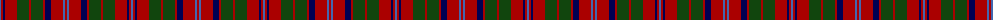

The parent of this is [MacQuarrie SM](/tartans/b/2/dr2/db2/dr12/dg12/dr2/dg12/dr2/db6/dr12/b2/dr/2/)

This was sourced from weddslist.  It is a [12 stripes tartan](/stripes/stripes12/).

Original link http://www.weddslist.com/cgi-bin/tartans/pg.pl?source=x

## Thread count
B/2 DR2 DB2 DR12 DG12 DR2 DG12 DR2 DB6 DR12 B2 DR/2

## Palette
Each colour and its ΔE from the base-6 reference it is a variant of.

| Colour | Shade | Base | ΔE (OKLab) |
|---|---|---|---|
| B |  `#4367AE` | B  | 0.13 |
| DB |  `#000052` | B  | 0.20 |
| DG |  `#11450D` | G  | 0.10 |
| DR |  `#AA0000` | R  | 0.06 |

ID: /variants/b/2/dr2/db2/dr12/dg12/dr2/dg12/dr2/db6/dr12/b2/dr/2-b4367ae-db000052-dg11450d-draa0000/
