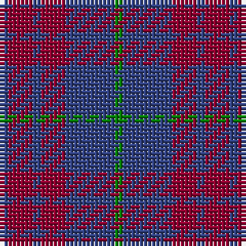

The parent of this is [Robbins](/tartans/b/2/dr6/b2/dr6/b12/g/2/)

This was sourced from weddslist.  It is a [6 stripes tartan](/stripes/stripes6/).

Original link http://www.weddslist.com/cgi-bin/tartans/pg.pl?source=sts

## Thread count
B/2 DR6 B2 DR6 B12 G/2

## Palette
Each colour and its ΔE from the base-6 reference it is a variant of.

| Colour | Shade | Base | ΔE (OKLab) |
|---|---|---|---|
| B |  `#304080` | B  | 0.01 |
| DR |  `#900030` | R  | 0.13 |
| G |  `#008000` | G  | 0.09 |

# Sample pattern

ID: /variants/b/2/dr6/b2/dr6/b12/g/2-b304080-dr900030-g008000/
