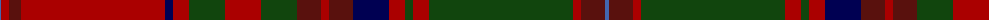

The parent of this is [MacDougall](/tartans/b/2/dr8/dra12/dr144/db8/dr16/dg36/dr36/dg36/dra24/dr8/dra24/db36/dr16/dg8/dr16/dg144/dr8/dra24/b/4/)

This was sourced from weddslist.  It is a [20 stripes tartan](/stripes/stripes20/).

Original link http://www.weddslist.com/cgi-bin/tartans/pg.pl?source=x

## Thread count
B/2 DR8 DRa12 DR144 DB8 DR16 DG36 DR36 DG36 DRa24 DR8 DRa24 DB36 DR16 DG8 DR16 DG144 DR8 DRa24 B/4

## Palette
Each colour and its ΔE from the base-6 reference it is a variant of.

| Colour | Shade | Base | ΔE (OKLab) |
|---|---|---|---|
| B |  `#4367AE` | B  | 0.13 |
| DB |  `#000052` | B  | 0.20 |
| DG |  `#11450D` | G  | 0.10 |
| DR |  `#AA0000` | R  | 0.06 |
| DRa |  `#59110D` | B  | 0.21 |

ID: /variants/b/2/dr8/dra12/dr144/db8/dr16/dg36/dr36/dg36/dra24/dr8/dra24/db36/dr16/dg8/dr16/dg144/dr8/dra24/b/4-b4367ae-db000052-dg11450d-draa0000-dra59110d/
