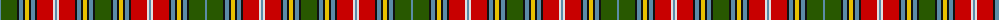

The parent of this is [MacWhirter](/tartans/b/2/g16/k2/b4/k2/y4/k2/b4/k2/r16/ln2/b2/ln2/r16/k2/b4/k2/y4/k2/b4/k2/g/16/)

This was sourced from register-of-tartans.  It is a [22 stripes tartan](/stripes/stripes22/).

Original link https://www.tartanregister.gov.uk/tartanDetails.aspx?ref=2775

## Thread count
B/2 G16 K2 B4 K2 Y4 K2 B4 K2 R16 LN2 B2 LN2 R16 K2 B4 K2 Y4 K2 B4 K2 G/16

## Palette
Each colour and its ΔE from the base-6 reference it is a variant of.

| Colour | Shade | Base | ΔE (OKLab) |
|---|---|---|---|
| B |  `#5C8CA8` | B  | 0.23 |
| G |  `#285800` | G  | 0.04 |
| K |  `#101010` | K  | 0.17 |
| LN |  `#E0E0E0` | W  | 0.06 |
| R |  `#C80000` | R  | 0.00 |
| Y |  `#E8C000` | Y  | 0.00 |

ID: /variants/b/2/g16/k2/b4/k2/y4/k2/b4/k2/r16/ln2/b2/ln2/r16/k2/b4/k2/y4/k2/b4/k2/g/16-b5c8ca8-g285800-k101010-lne0e0e0-rc80000-ye8c000/
