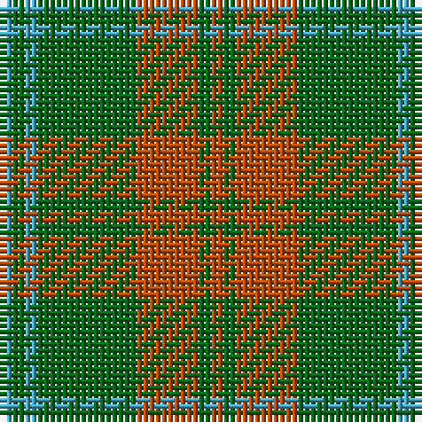

The parent of this is [O'Neill Pipe Band 1983 (Corporate)](/tartans/b/2/g2/b2/g16/do10/g2/do/2/)

This was sourced from tartans-authority.  It is a [7 stripes tartan](/stripes/stripes7/).

Original link http://www.tartansauthority.com/tartan-ferret/display/5536/

## Thread count
B/2 G2 B2 G16 DO10 G2 DO/2

## Palette
Each colour and its ΔE from the base-6 reference it is a variant of.

| Colour | Shade | Base | ΔE (OKLab) |
|---|---|---|---|
| B |  `#48A4C0` | Y  | 0.28 |
| DO |  `#B84C00` | R  | 0.08 |
| G |  `#006818` | G  | 0.02 |

# Sample pattern

ID: /variants/b/2/g2/b2/g16/do10/g2/do/2-b48a4c0-dob84c00-g006818/
