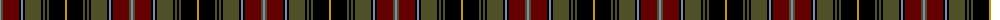

The parent of this is [Unidentified #63](/tartans/b/2/g2/dr16/k2/b2/k2/g16/k2/g2/k2/g2/k16/dy/2/)

This was sourced from register-of-tartans.  It is a [13 stripes tartan](/stripes/stripes13/).

Original link https://www.tartanregister.gov.uk/tartanDetails.aspx?ref=4264

## Thread count
B/2 G2 DR16 K2 B2 K2 G16 K2 G2 K2 G2 K16 DY/2

## Palette
Each colour and its ΔE from the base-6 reference it is a variant of.

| Colour | Shade | Base | ΔE (OKLab) |
|---|---|---|---|
| B |  `#788CB4` | B  | 0.25 |
| DR |  `#640000` | R  | 0.22 |
| DY |  `#C89800` | Y  | 0.12 |
| G |  `#505028` | G  | 0.11 |
| K |  `#000000` | K  | 0.00 |

ID: /variants/b/2/g2/dr16/k2/b2/k2/g16/k2/g2/k2/g2/k16/dy/2-b788cb4-dr640000-dyc89800-g505028-k000000/
