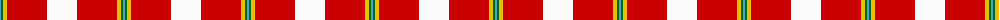
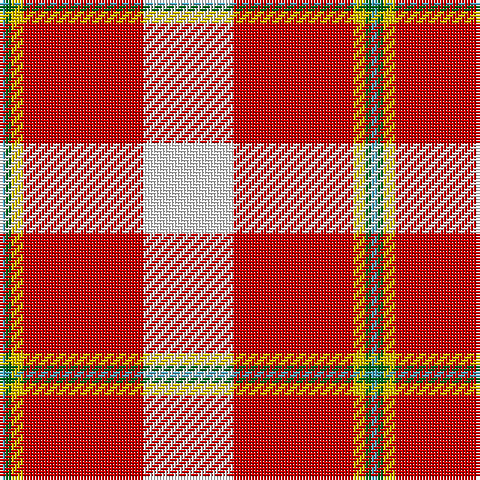

The parent of this is [Tomomi](/tartans/b/2/g2/y4/r40/w/30/)

This was sourced from tartans-authority.  It is a [5 stripes tartan](/stripes/stripes5/).

Original link http://www.tartansauthority.com/tartan-ferret/display/11001/

## Thread count
B/2 G2 Y4 R40 W/30

## Palette
Each colour and its ΔE from the base-6 reference it is a variant of.

| Colour | Shade | Base | ΔE (OKLab) |
|---|---|---|---|
| B |  `#48A4C0` | Y  | 0.28 |
| G |  `#006818` | G  | 0.02 |
| R |  `#C80000` | R  | 0.00 |
| W |  `#FCFCFC` | W  | 0.03 |
| Y |  `#E8C000` | Y  | 0.00 |

# Sample pattern

ID: /variants/b/2/g2/y4/r40/w/30-b48a4c0-g006818-rc80000-wfcfcfc-ye8c000/
