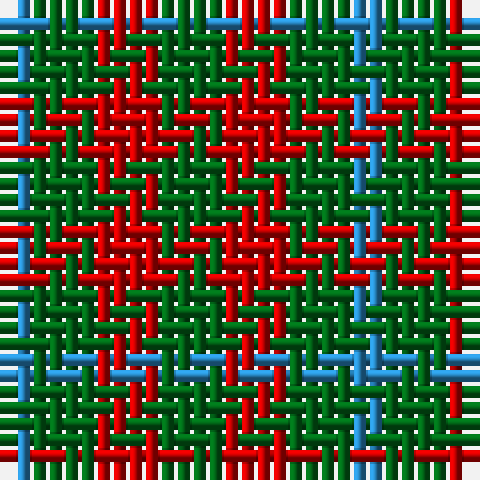

The parent of this is [Wilson's No.207](/tartans/b/2/g4/r4/g/4/)

This was sourced from register-of-tartans.  It is a [4 stripes tartan](/stripes/stripes4/).

Original link https://www.tartanregister.gov.uk/tartanDetails.aspx?ref=4738

## Thread count
B/2 G4 R4 G/4

## Palette
Each colour and its ΔE from the base-6 reference it is a variant of.

| Colour | Shade | Base | ΔE (OKLab) |
|---|---|---|---|
| B |  `#2888C4` | B  | 0.21 |
| DG |  `#003820` | G  | 0.16 |
| G |  `#006818` | G  | 0.02 |
| LG |  `#789484` | G  | 0.23 |
| P |  `#780078` | B  | 0.16 |
| R |  `#C80000` | R  | 0.00 |
| Ra |  `#C80000` | R  | 0.00 |

# Sample pattern

ID: /variants/b/2/g4/r4/g/4-b2888c4-dg003820-g006818-lg789484-p780078-rc80000-rac80000/
