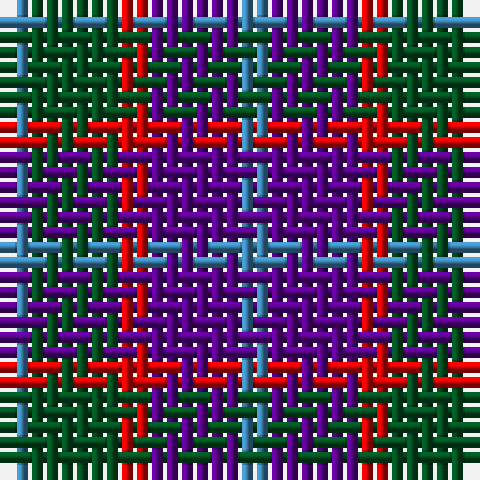

The parent of this is [Wilson's No.95](/tartans/b/2/g6/r2/p6/b/2/)

This was sourced from register-of-tartans.  It is a [5 stripes tartan](/stripes/stripes5/).

Original link https://www.tartanregister.gov.uk/tartanDetails.aspx?ref=4762

## Thread count
B/2 G6 R2 P6 B/2

## Palette
Each colour and its ΔE from the base-6 reference it is a variant of.

| Colour | Shade | Base | ΔE (OKLab) |
|---|---|---|---|
| B |  `#3C82AF` | B  | 0.20 |
| G |  `#005020` | G  | 0.08 |
| P |  `#5A008C` | B  | 0.12 |
| R |  `#DC0000` | R  | 0.04 |

# Sample pattern

ID: /variants/b/2/g6/r2/p6/b/2-b3c82af-g005020-p5a008c-rdc0000/
