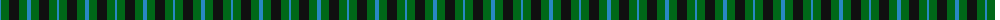
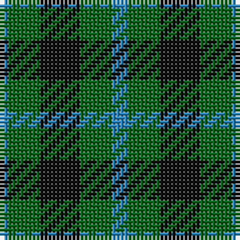

The parent of this is [Glen Lyon #2](/tartans/b/2/g8/k10/g8/b/4/)

This was sourced from register-of-tartans.  It is a [5 stripes tartan](/stripes/stripes5/).

Original link https://www.tartanregister.gov.uk/tartanDetails.aspx?ref=1382

## Thread count
B/2 G8 K10 G8 B/4

## Palette
Each colour and its ΔE from the base-6 reference it is a variant of.

| Colour | Shade | Base | ΔE (OKLab) |
|---|---|---|---|
| B |  `#2888C4` | B  | 0.21 |
| G |  `#006818` | G  | 0.02 |
| K |  `#101010` | K  | 0.17 |

# Sample pattern

ID: /variants/b/2/g8/k10/g8/b/4-b2888c4-g006818-k101010/
