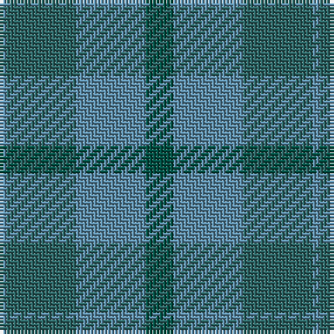

The parent of this is [Baker City (Estimated threadcount)](/tartans/b/2/ga20/b20/g/8/)

This was sourced from register-of-tartans.  It is a [4 stripes tartan](/stripes/stripes4/).

Original link https://www.tartanregister.gov.uk/tartanDetails.aspx?ref=5501

## Thread count
B/2 Ga20 B20 G/8

## Palette
Each colour and its ΔE from the base-6 reference it is a variant of.

| Colour | Shade | Base | ΔE (OKLab) |
|---|---|---|---|
| B |  `#5C8CA8` | B  | 0.23 |
| Ba |  `#1870A4` | B  | 0.14 |
| G |  `#005044` | G  | 0.11 |
| Ga |  `#2C6464` | G  | 0.13 |
| LG |  `#789484` | G  | 0.23 |

# Sample pattern

ID: /variants/b/2/ga20/b20/g/8-b5c8ca8-ba1870a4-g005044-ga2c6464-lg789484/
