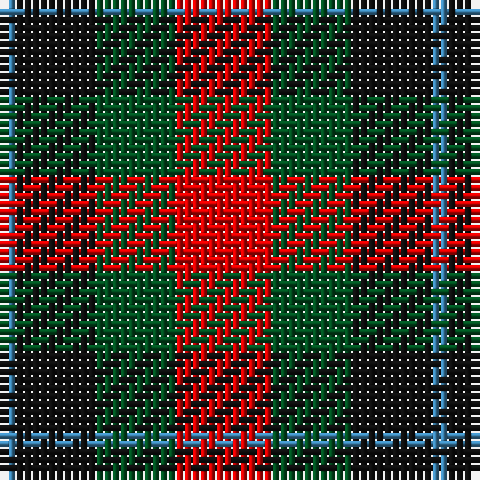

The parent of this is [Unidentified No 28](/tartans/b/2/k10/g10/r/12/)

This was sourced from register-of-tartans.  It is a [4 stripes tartan](/stripes/stripes4/).

Original link https://www.tartanregister.gov.uk/tartanDetails.aspx?ref=4319

## Thread count
B/2 K10 G10 R/12

## Palette
Each colour and its ΔE from the base-6 reference it is a variant of.

| Colour | Shade | Base | ΔE (OKLab) |
|---|---|---|---|
| B |  `#3C82AF` | B  | 0.20 |
| G |  `#005020` | G  | 0.08 |
| K |  `#101010` | K  | 0.17 |
| R |  `#DC0000` | R  | 0.04 |

# Sample pattern

ID: /variants/b/2/k10/g10/r/12-b3c82af-g005020-k101010-rdc0000/
