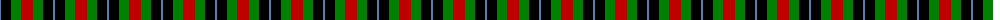
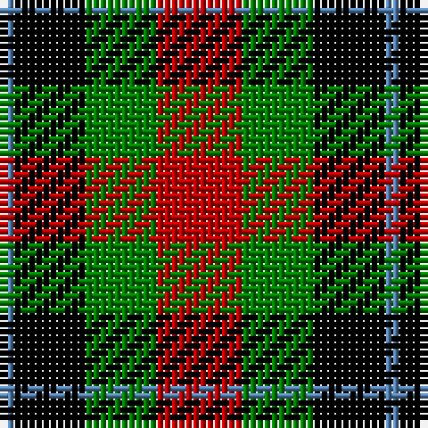

The parent of this is [Unnamed, No 28](/tartans/b/2/k10/g10/r/12/)

This was sourced from weddslist.  It is a [4 stripes tartan](/stripes/stripes4/).

Original link http://www.weddslist.com/cgi-bin/tartans/pg.pl?source=sts

## Thread count
B/2 K10 G10 R/12

## Palette
Each colour and its ΔE from the base-6 reference it is a variant of.

| Colour | Shade | Base | ΔE (OKLab) |
|---|---|---|---|
| B |  `#5480B0` | B  | 0.20 |
| G |  `#008000` | G  | 0.09 |
| K |  `#000000` | K  | 0.00 |
| R |  `#C00000` | R  | 0.02 |

# Sample pattern

ID: /variants/b/2/k10/g10/r/12-b5480b0-g008000-k000000-rc00000/
